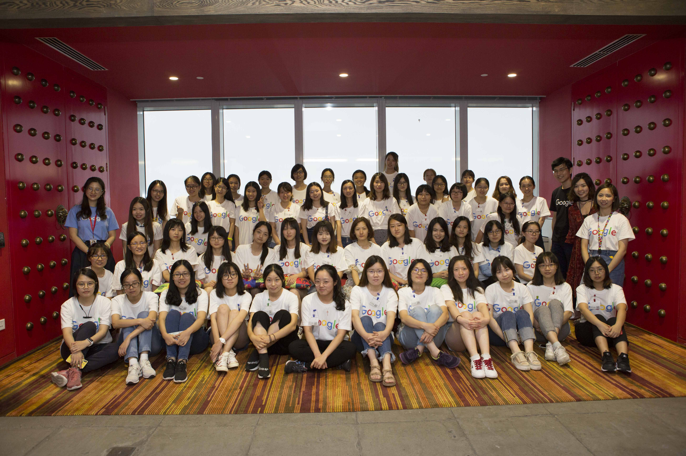

# New_bus_route_planning_system
Source code of New bus route planning system based on NYC Taxi trip duration, Google Girl Hackthon 2018

Google Girl Hackthon Season Ⅳ

* The background of the Google Girl Hackthon contest: [Introduction of Google Girl Hackthon][1]

* Data source: https://www.kaggle.com/c/nyc-taxi-trip-duration/data

* The background and purpose of our project, please refer to: [Introduction short film][2]

* This project uses density clustering and heuristic search to choose recommendation route based on the flow of people by the taxi record data of New York City. To see the introduction of our technology and algorithms, please refer to: [presentation slides][3]

* Achievement: This project gets the **impact mention & The best team** on Google girl hackthon season 4 and get awarding words: "Innovations, Strong social Responsibility, and Great Presentation!"

Acknowledgement: Also very grateful to the other members of this team for their effort. They are(names not listed in order): Jiayi Mao(Tsinghua University), Minyan Wu(Huazhong University of Science and Technology), Mengyun Chen(East China Normal University), Kehan Xu(Peking University)

Participant of Google Girl Hackthon Season Ⅳ:

Award as The Best Team in the competition:

Take photos with medals and prizes:

[1]: https://www.youtube.com/watch?v=U4JTUffoGR0
[2]: https://github.com/PurityFan/New_bus_route_planning_system/blob/master/%5Bbackground%5Dtechnology%20make%20a%20better%20world.mp4
[3]: https://github.com/PurityFan/New_bus_route_planning_system/blob/master/presentation.pdf